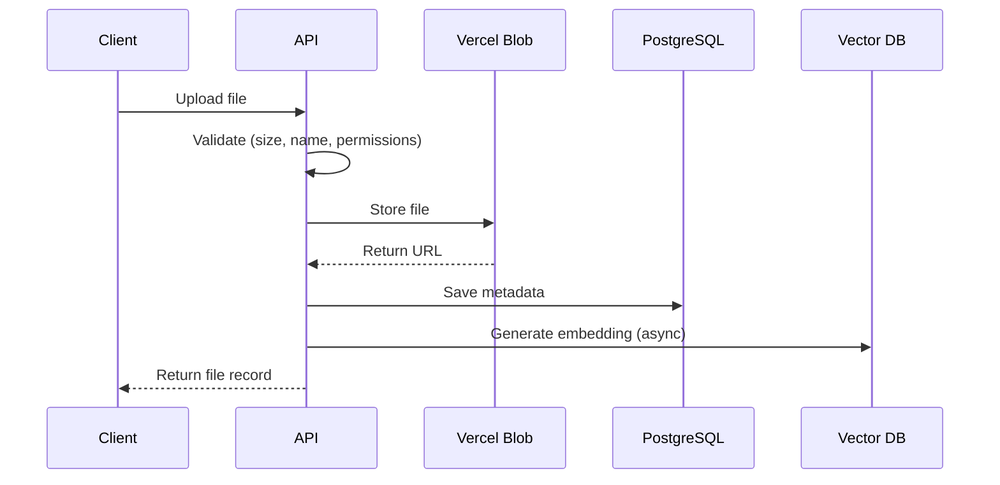

# Data Model Architecture

## Overview

Atlas v2 implements a sophisticated multi-tenant data architecture designed for scalability, collaboration, and AI-powered features. The system combines traditional relational patterns with modern cloud storage and vector databases.

## Architecture Principles

### 1. Multi-Tenancy Design

The application supports three ownership contexts:

```
┌─────────────────────────────────────┐
│          User (Personal)            │
│  ┌─────────────────────────────┐    │
│  │  Personal Spaces            │    │
│  │  - Private files            │    │
│  │  - Personal notes           │    │
│  │  - Individual chats         │    │
│  └─────────────────────────────┘    │
└─────────────────────────────────────┘
                  ↓
┌─────────────────────────────────────┐
│         Organization                │
│  ┌─────────────────────────────┐    │
│  │  Organization Spaces        │    │
│  │  - Shared resources         │    │
│  │  - Team collaboration       │    │
│  │  - Centralized billing      │    │
│  └─────────────────────────────┘    │
└─────────────────────────────────────┘
```

### 2. Data Ownership Hierarchy

```
User
 ├── Personal Spaces
 │    ├── Chats
 │    ├── Notes
 │    ├── Files
 │    └── Tasks
 │
 └── Organization Memberships
      └── Organization
           ├── Organization Spaces
           │    ├── Shared Chats
           │    ├── Shared Notes
           │    ├── Shared Files
           │    └── Shared Tasks
           └── Members
```

## Core Entities

### User Entity
**Purpose**: Central identity and authentication

**Key Relationships**:
- **Direct Ownership**: Personal spaces, files, notes, chats
- **Memberships**: Organizations and spaces
- **Permissions**: File access, space access

**Data Flow**:
```
User → Authentication → Session → Active Context (Org/Space)
```

### Organization Entity
**Purpose**: Team collaboration and resource sharing

**Features**:
- Centralized billing via Polar.sh
- Member role management
- Shared workspaces
- Invitation system

**Access Control**:
```
Organization Admin → Full access
Organization Member → Limited access based on role
Space Member → Access to specific spaces only
```

### Space Entity
**Purpose**: Isolated workspace for content organization

**Types**:
1. **Personal Space**: `userId` set, `organizationId` null
2. **Organization Space**: `organizationId` set, `userId` null

**Key Features**:
- Unique slug per owner (user or org)
- Privacy controls (private/public)
- Member management
- Content isolation

### File System Architecture

```
File Storage Architecture
├── PostgreSQL (Metadata)
│   ├── File records
│   ├── Folder structure
│   ├── Permissions
│   └── Versions
│
├── Vercel Blob (Storage)
│   ├── Actual file content
│   ├── Public URLs
│   └── CDN distribution
│
└── Upstash Vector (Search)
    ├── File embeddings
    ├── Content extraction
    └── Similarity search
```

**Folder Structure**:
- Virtual folders via metadata
- Parent-child relationships
- Path-based navigation
- No physical directories

**Permission Model**:
```
File Visibility Levels:
- private: Owner only
- space: Space members
- organization: Org members
- public: Anyone with link
```

### Chat System Architecture

**AI SDK v5 Integration**:
```typescript
Message Structure:
{
  role: 'system' | 'user' | 'assistant' | 'tool',
  parts: [
    { type: 'text', content: string },
    { type: 'image', url: string },
    { type: 'tool-call', ... },
    { type: 'tool-result', ... }
  ]
}
```

**Stream Management**:
- Real-time streaming via `chatStream` table
- Message persistence in `message` table
- Context preservation across sessions

### Task Processing Architecture

```
Task Lifecycle:
pending → queued → running → completed/failed
           ↓         ↓
    [Trigger.dev]  [Stream Output]
           ↓         ↓
    [Background]  [Real-time Updates]
```

**Integration Points**:
- Trigger.dev for orchestration
- Stream tables for real-time updates
- Error handling and retry logic

## Data Storage Patterns

### 1. Hybrid Storage Strategy

| Data Type | Storage | Reason |
|-----------|---------|---------|
| Metadata | PostgreSQL | ACID compliance, relationships |
| Files | Vercel Blob | CDN, scalability, cost |
| Embeddings | Upstash Vector | Similarity search |
| Cache | Upstash Redis | Performance |
| Search Index | PostgreSQL + Vector | Hybrid search |

### 2. File Upload Flow



### 3. Search Architecture

**Multi-layer Search**:
1. **PostgreSQL**: Exact matches, metadata filters
2. **Vector DB**: Semantic search, similarity
3. **Hybrid**: Combine results with ranking

## Caching Strategy

### Redis Cache Layers

```
┌─────────────────────┐
│   Request Cache     │ → Rate limiting
├─────────────────────┤
│   Session Cache     │ → Auth optimization
├─────────────────────┤
│   Query Cache       │ → Database results
├─────────────────────┤
│   File Cache        │ → Blob metadata
└─────────────────────┘
```

### Cache Invalidation
- TTL-based expiration
- Event-driven invalidation
- Cascade invalidation for related data

## Data Consistency Patterns

### 1. Transaction Boundaries
```typescript
// Example: Creating space with initial content
await db.transaction(async (tx) => {
  const space = await tx.insert(spaceTable)...
  const member = await tx.insert(spaceMemberTable)...
  const note = await tx.insert(noteTable)...
})
```

### 2. Cascade Operations
- Space deletion → Delete all content
- File deletion → Clean blob storage
- User deletion → Anonymize or transfer ownership

### 3. Eventual Consistency
- Vector embeddings generated async
- File processing in background
- Search index updates delayed

## Security Architecture

### Access Control Layers

```
Request → Authentication → Authorization → Resource Access
           ↓                ↓               ↓
        Session          Ownership      Permission
        Validation       Check          Validation
```

### Data Isolation
1. **Row-Level Security**: Filter by userId/spaceId/orgId
2. **Permission Tables**: Explicit access grants
3. **Visibility Levels**: Graduated access control

### Sensitive Data Handling
- Passwords: Bcrypt hashing via Better Auth
- Tokens: Secure random generation
- API Keys: Environment variables only
- PII: Minimal storage, encryption at rest

## Performance Optimization

### Database Optimization
1. **Indexes**:
   - Foreign keys
   - Composite for common queries
   - Partial indexes for filtered queries

2. **Query Patterns**:
   ```sql
   -- Optimized space content query
   SELECT * FROM files 
   WHERE space_id = ? AND user_id = ?
   ORDER BY created_at DESC
   LIMIT 20
   ```

3. **Connection Pooling**:
   - Managed by Drizzle/PostgreSQL
   - Serverless-friendly connections

### Blob Storage Optimization
- CDN distribution via Vercel
- Automatic image optimization
- Bandwidth optimization
- Regional caching

### Vector Search Optimization
- Dimension reduction for embeddings
- Namespace isolation
- Batch processing
- Approximate nearest neighbor

## Scalability Considerations

### Horizontal Scaling
- Stateless API design
- Database read replicas
- CDN for static assets
- Distributed caching

### Vertical Scaling
- Database connection limits
- Blob storage quotas
- Vector index size
- Rate limiting tiers

### Data Partitioning Strategy
- Partition by organization for large deployments
- Archive old data to cold storage
- Separate indexes per namespace

## Migration & Evolution

### Schema Evolution
1. **Forward Compatibility**: New fields nullable
2. **Backward Compatibility**: Maintain old fields
3. **Migration Scripts**: Version controlled
4. **Rollback Strategy**: Always reversible

### Data Migration Patterns
```bash
# Safe migration process
1. Add new column (nullable)
2. Backfill data
3. Add constraints
4. Update application code
5. Remove old column (later)
```

## Monitoring & Observability

### Key Metrics
- Query performance (p50, p95, p99)
- Storage usage trends
- API response times
- Cache hit rates
- Error rates by endpoint

### Health Checks
```typescript
// Health check endpoints
/api/health → Basic availability
/api/health/db → Database connection
/api/health/blob → Blob storage access
/api/health/redis → Cache availability
```

## Disaster Recovery

### Backup Strategy
1. **Database**: Daily automated backups
2. **Blob Storage**: Versioning enabled
3. **Configuration**: Version controlled
4. **Secrets**: Secure backup vault

### Recovery Procedures
- RPO (Recovery Point Objective): < 24 hours
- RTO (Recovery Time Objective): < 4 hours
- Automated failover for critical services
- Manual intervention for data recovery