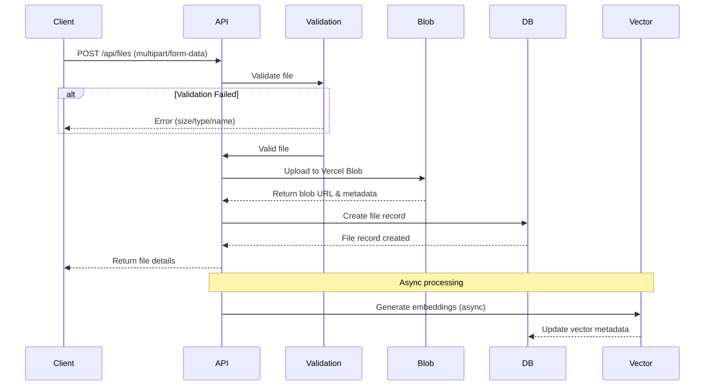

# File Storage Architecture

## Overview

Atlas v2 implements a distributed file storage system combining PostgreSQL for metadata, Vercel Blob for content storage, and Upstash Vector for semantic search capabilities. This architecture provides scalability, performance, and advanced search features.

## Storage Components

### 1. PostgreSQL (Metadata Layer)

Stores all file metadata, permissions, and organizational structure.

**Responsibilities**:
- File records and metadata
- Folder hierarchy (virtual)
- Access permissions
- Version history
- User associations

### 2. Vercel Blob (Content Storage)

Handles actual file content with global CDN distribution.

**Features**:
- Automatic CDN distribution
- Direct browser uploads
- Immutable storage
- Public/private access control
- Bandwidth optimization

### 3. Upstash Vector (Search Layer)

Provides semantic search and content discovery.

**Capabilities**:
- Content embeddings
- Similarity search
- Document clustering
- Intelligent recommendations

## File Upload Flow

### Standard Upload Process



### File Validation Rules

```typescript
// File name validation
const INVALID_PATTERNS = [
  /\.\./,           // Path traversal
  /^\./, 		      // Hidden files
  /[<>:"|?*]/,      // Invalid characters
  /[\x00-\x1f]/,    // Control characters
];

// Size limits
const MAX_FILE_SIZE = 100 * 1024 * 1024; // 100MB

// Content type validation
const ALLOWED_TYPES = [
  'image/*',
  'application/pdf',
  'text/*',
  'application/json',
  'application/zip',
  // ... specific types
];
```

## Folder Management

### Virtual Folder Structure

Folders are implemented as special file records with `contentType: 'folder'`.

```typescript
// Folder metadata structure
{
  id: "folder_id",
  filename: "Documents",
  contentType: "folder",
  metadata: {
    isFolder: true,
    parentId: "parent_folder_id",
    path: "/root/parent/Documents"
  }
}
```

### Path Resolution

```typescript
// Path construction
function constructPath(file: FileRecord): string {
  const parts = [];
  let current = file;
  
  while (current.metadata?.parentId) {
    parts.unshift(current.filename);
    current = await fetchFileById(current.metadata.parentId);
  }
  
  return '/' + parts.join('/');
}
```

## Permission System

### Permission Levels

| Level | Description | Capabilities |
|-------|-------------|--------------|
| `view` | Read-only access | Download, view content |
| `edit` | Modify content | Update, rename, move |
| `delete` | Remove file | Delete file and versions |
| `share` | Manage access | Grant/revoke permissions |

### Visibility Scopes

```typescript
enum FileVisibility {
  PRIVATE = 'private',           // Owner only
  SPACE = 'space',               // Space members
  ORGANIZATION = 'organization',  // Org members
  PUBLIC = 'public'              // Anyone with link
}
```

### Permission Inheritance

```
Organization
    ↓ (inherits)
  Space
    ↓ (inherits)
  Folder
    ↓ (inherits)
  File
```

## File Versioning

### Version Management

Each file can have multiple versions stored in the `fileVersion` table.

```typescript
interface FileVersion {
  id: string;
  fileId: string;
  versionNumber: string;  // Semantic versioning
  blobUrl: string;        // Version-specific URL
  size: string;
  checksum: string;       // Integrity verification
  uploadedBy: string;
  comment: string;        // Version description
  createdAt: Date;
}
```

### Version Operations

```typescript
// Upload new version
async function uploadNewVersion(
  fileId: string,
  newFile: File,
  comment?: string
) {
  const currentVersion = await getLatestVersion(fileId);
  const newVersionNumber = incrementVersion(currentVersion.versionNumber);
  
  const blob = await uploadToBlob(newFile);
  const checksum = await calculateChecksum(newFile);
  
  return createFileVersion({
    fileId,
    versionNumber: newVersionNumber,
    blobUrl: blob.url,
    checksum,
    comment
  });
}
```

## Blob Storage Configuration

### Storage Paths

```typescript
// Path generation strategy
function generateBlobPath(
  userId: string,
  filename: string,
  parentId?: string
): string {
  const timestamp = Date.now();
  const sanitized = sanitizeFilename(filename);
  
  if (parentId) {
    return `users/${userId}/folders/${parentId}/${timestamp}-${sanitized}`;
  }
  return `users/${userId}/files/${timestamp}-${sanitized}`;
}
```

### Blob Configuration

```typescript
// Upload configuration
const blobConfig = {
  access: 'public',           // or 'private'
  addRandomSuffix: false,     // Control URL generation
  cacheControlMaxAge: 31536000, // 1 year for immutable content
  contentType: file.type,
  contentDisposition: 'inline', // or 'attachment' for downloads
};

// Upload with configuration
const blob = await put(pathname, file, blobConfig);
```

## Vector Search Integration

### Embedding Generation

```typescript
// Generate embeddings for searchable content
async function generateFileEmbedding(file: FileRecord) {
  // Extract text content
  const text = await extractTextContent(file);
  
  // Generate embedding
  const embedding = await generateEmbedding(text);
  
  // Store in vector database
  const vectorId = await vectorIndex.upsert({
    id: file.id,
    vector: embedding,
    metadata: {
      title: file.filename,
      content: text.substring(0, 1000),
      type: file.contentType,
      userId: file.userId,
      createdAt: Date.now()
    }
  });
  
  // Update file record
  await updateFileRecord(file.id, {
    vectorId,
    embedding,
    extractedText: text
  });
}
```

### Similarity Search

```typescript
// Search similar files
async function findSimilarFiles(
  query: string,
  userId: string,
  limit = 10
) {
  const queryEmbedding = await generateEmbedding(query);
  
  const results = await vectorIndex.query({
    vector: queryEmbedding,
    topK: limit,
    filter: {
      userId: { $eq: userId }
    },
    includeMetadata: true
  });
  
  return results.map(r => ({
    fileId: r.id,
    score: r.score,
    metadata: r.metadata
  }));
}
```

## Content Processing

### Text Extraction

```typescript
// Extract text from various file types
async function extractTextContent(file: FileRecord): Promise<string> {
  switch (file.contentType) {
    case 'text/plain':
    case 'text/markdown':
      return await fetchTextContent(file.blobUrl);
      
    case 'application/pdf':
      return await extractPDFText(file.blobUrl);
      
    case 'application/json':
      const json = await fetchJSON(file.blobUrl);
      return JSON.stringify(json, null, 2);
      
    case 'image/*':
      return await performOCR(file.blobUrl);
      
    default:
      return file.filename; // Fallback to filename
  }
}
```

### Image Processing

```typescript
// Image optimization pipeline
async function processImage(file: File): Promise<ProcessedImage> {
  // Generate thumbnails
  const thumbnail = await generateThumbnail(file, {
    width: 200,
    height: 200,
    fit: 'cover'
  });
  
  // Optimize for web
  const optimized = await optimizeImage(file, {
    quality: 85,
    format: 'webp'
  });
  
  // Extract metadata
  const metadata = await extractImageMetadata(file);
  
  return {
    original: file,
    thumbnail,
    optimized,
    metadata
  };
}
```

## Caching Strategy

### Multi-Level Cache

```typescript
// Cache hierarchy
const cacheStrategy = {
  // L1: Browser cache (via CDN headers)
  browser: {
    maxAge: 31536000, // 1 year for immutable content
    sMaxAge: 86400,   // 1 day for CDN
  },
  
  // L2: Redis cache for metadata
  redis: {
    fileMetadata: 300,     // 5 minutes
    folderContents: 60,    // 1 minute
    permissions: 600,      // 10 minutes
  },
  
  // L3: Database query cache
  database: {
    prepared: true,        // Use prepared statements
    poolSize: 10,         // Connection pool
  }
};
```

### Cache Invalidation

```typescript
// Invalidate related caches on file update
async function invalidateFileCaches(fileId: string) {
  const file = await fetchFileById(fileId);
  
  // Clear Redis caches
  await redis.del(`file:${fileId}`);
  await redis.del(`folder:${file.metadata?.parentId}`);
  
  // Clear CDN cache
  await purgeCloudflareCache(file.blobUrl);
  
  // Update search index
  await updateVectorIndex(fileId);
}
```

## Security Measures

### Access Control

```typescript
// Validate file access
async function validateFileAccess(
  fileId: string,
  userId: string,
  requiredPermission: Permission
): Promise<boolean> {
  const file = await fetchFileById(fileId);
  
  // Owner has full access
  if (file.userId === userId) return true;
  
  // Check visibility
  if (file.visibility === 'public' && requiredPermission === 'view') {
    return true;
  }
  
  // Check space membership
  if (file.spaceId) {
    const isMember = await checkSpaceMembership(file.spaceId, userId);
    if (isMember && file.visibility === 'space') return true;
  }
  
  // Check explicit permissions
  const permission = await fetchFilePermission(fileId, userId);
  return hasPermission(permission, requiredPermission);
}
```

### Secure URLs

```typescript
// Generate signed URLs for private content
async function generateSignedUrl(
  file: FileRecord,
  expiresIn = 3600 // 1 hour
): Promise<string> {
  if (file.visibility === 'public') {
    return file.blobUrl;
  }
  
  const signature = await signUrl(file.blobUrl, {
    expiresIn,
    userId: file.userId,
    fileId: file.id
  });
  
  return `${file.blobUrl}?signature=${signature}`;
}
```

## Performance Optimization

### Chunked Uploads

```typescript
// Handle large file uploads in chunks
async function uploadChunked(
  file: File,
  chunkSize = 5 * 1024 * 1024 // 5MB chunks
) {
  const chunks = Math.ceil(file.size / chunkSize);
  const uploadId = generateUploadId();
  
  for (let i = 0; i < chunks; i++) {
    const start = i * chunkSize;
    const end = Math.min(start + chunkSize, file.size);
    const chunk = file.slice(start, end);
    
    await uploadChunk(uploadId, i, chunk);
  }
  
  return completeMultipartUpload(uploadId);
}
```

### Parallel Processing

```typescript
// Process multiple files in parallel
async function batchUpload(files: File[]) {
  const BATCH_SIZE = 5;
  const results = [];
  
  for (let i = 0; i < files.length; i += BATCH_SIZE) {
    const batch = files.slice(i, i + BATCH_SIZE);
    const batchResults = await Promise.all(
      batch.map(file => uploadFile(file))
    );
    results.push(...batchResults);
  }
  
  return results;
}
```

## Monitoring & Analytics

### Key Metrics

```typescript
interface FileMetrics {
  totalFiles: number;
  totalSize: bigint;
  averageFileSize: number;
  filesByType: Record<string, number>;
  uploadsPerDay: number;
  activeUsers: number;
  storageGrowthRate: number;
}

// Collect metrics
async function collectFileMetrics(): Promise<FileMetrics> {
  const [stats] = await db
    .select({
      totalFiles: count(),
      totalSize: sum(file.size),
      averageSize: avg(file.size),
    })
    .from(file);
    
  return processMetrics(stats);
}
```

### Health Checks

```typescript
// Storage health monitoring
async function checkStorageHealth() {
  const checks = {
    database: await checkDatabaseConnection(),
    blob: await checkBlobAccess(),
    vector: await checkVectorService(),
    redis: await checkRedisConnection(),
  };
  
  return {
    healthy: Object.values(checks).every(v => v),
    services: checks,
    timestamp: new Date()
  };
}
```

## Disaster Recovery

### Backup Strategy

```typescript
// Backup configuration
const backupConfig = {
  // Metadata backups (PostgreSQL)
  database: {
    frequency: 'daily',
    retention: 30, // days
    location: 's3://backups/database/',
  },
  
  // Blob storage backups
  blobs: {
    replication: 'cross-region',
    versioning: true,
    lifecycle: {
      archive: 90,  // days to archive
      delete: 365,  // days to delete
    }
  },
  
  // Vector index backups
  vectors: {
    frequency: 'weekly',
    format: 'snapshot',
  }
};
```

### Recovery Procedures

```typescript
// File recovery process
async function recoverFile(fileId: string, version?: string) {
  // Recover metadata from backup
  const metadata = await recoverFileMetadata(fileId);
  
  // Recover blob from versioned storage
  const blobUrl = version 
    ? await recoverBlobVersion(fileId, version)
    : await recoverLatestBlob(fileId);
    
  // Rebuild vector embeddings
  await regenerateEmbeddings(fileId);
  
  // Restore permissions
  await restoreFilePermissions(fileId);
  
  return { success: true, fileId, recovered: new Date() };
}
```

## Best Practices

### File Organization
1. Use meaningful folder structures
2. Implement consistent naming conventions
3. Regular cleanup of orphaned files
4. Archive old versions periodically

### Performance
1. Implement progressive loading for large lists
2. Use pagination for folder contents
3. Cache frequently accessed files
4. Optimize images before upload

### Security
1. Validate all file uploads
2. Scan for malware/viruses
3. Implement rate limiting
4. Regular permission audits

### Maintenance
1. Monitor storage quotas
2. Clean up expired permissions
3. Optimize database indexes
4. Regular backup verification